# Dining Philosophers Problem - Rust
Five philosophers dine together at the same table. Each philosopher has their own place at the table. There is a fork between each plate. The dish served is a kind of spaghetti which has to be eaten with two forks. Each philosopher can only alternately think and eat. Moreover, a philosopher can only eat their spaghetti when they have both a left and right fork. Thus two forks will only be available when their two nearest neighbors are thinking, not eating. After an individual philosopher finishes eating, they will put down both forks.

<hr>

## Example STDOUT


<hr>

## Sequence Diagram


<hr>

## Build
```
cargo build
```

## Run
```
./target/debug/dining-philosophers
```